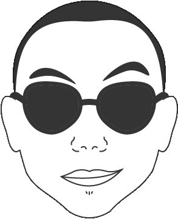

   

<h3 align="center"> Hello Hello </h3>

   <samp>
      Developer Student & UI Designer
   </samp>

   <samp>
     Tv Series and Gaming Enthusiast, Self Improving founder, Feeding Cats Contributor
      
     In 🖤 with creative coding. Laravel and Vue.JS are my current &#127773; and &#11088;  
       
  </samp>

   
   
   
   
   
   

